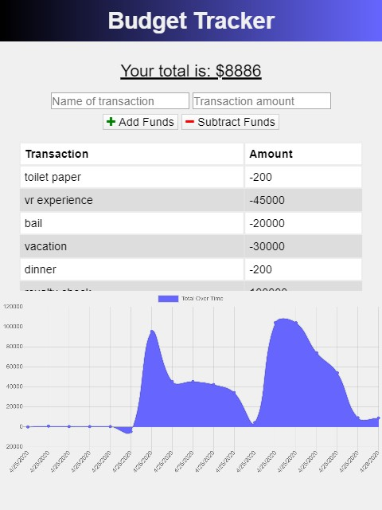
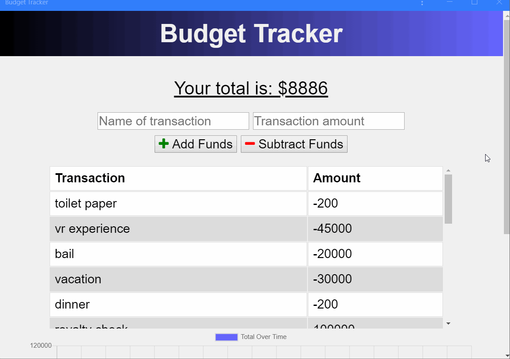

# Budget Tracker

  &nbsp;&nbsp;&nbsp; 	 
  &nbsp;&nbsp;&nbsp; 	 
  
 &nbsp;&nbsp;&nbsp; 	 
  
 &nbsp;&nbsp;&nbsp; 	 
  

## Table of Contents

* [User Story](#user-story)
* [Business Context](#business-context)
* [Installation](#installation)
* [Screenshots](#screenshots)
* [Built With](#built-with)

## User Story
AS AN avid traveller
I WANT to be able to track my withdrawals and deposits with or without a data/internet connection
SO THAT my account balance is accurate when I am traveling
* To check out my app on Heroku go here: https://on-offline-budget-tracker.herokuapp.com/

## Business Context

Giving users a fast and easy way to track their money is important, but allowing them to access that information anytime is even more important. Having offline functionality is paramount to our applications success.

## Installation

 * Clone this repository from Github from the command line by typing:  
   `git clone https://github.com/alexcoulter/budget-tracker.git`
  * Navigate to the 'fitness-time' folder by typing:  
  `cd budget-tracker` 
  * Install dependencies by typing:  
   `npm install`
  * Run this application by typing:   
  `node server` 
  * Open this application in your browser by typing the url:
  `http://localhost:3000/`
  
  ## Screenshots
* Ipad Screenshot

* Downloaded App Use

   
   ## Built With  

* **Node.js** -  JavaScript environment that executes JS code without needing a web browser
* **Express** - Web application framework that helped with routes and requests
* **MongoDB** - Flexible NoSQL database program
* **Mongoose** - Object modeling library for MongoDB
* **IndexedDB** - Api for client-side storage of data for offline use
* **Manifest** - provides information about a web application in a JSON text file, necessary for the web app to be downloaded and be presented to the user similarly to a native app
* **Service Worker** - provides feature for cache api and holds static files and data locally for offline use
